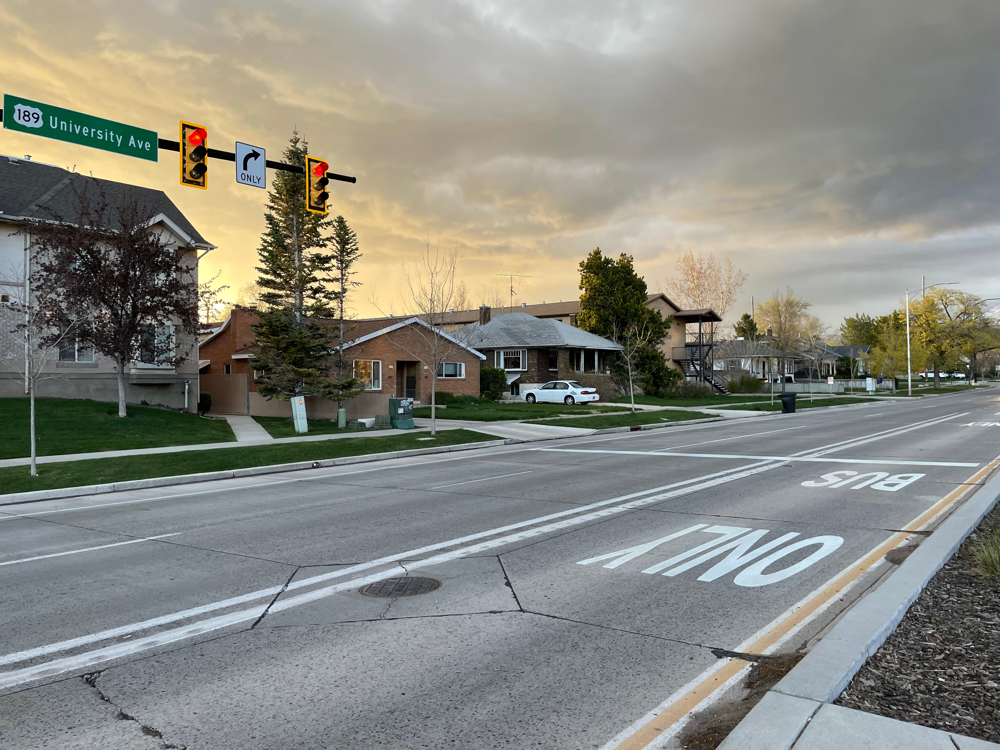

```{r setup, include=FALSE}
knitr::opts_chunk$set(echo = TRUE)
```
I’ve started to realize how *nice* it is to take the bus. During my growing-up years it was difficult to imagine anything other than driving, but now that I’ve spent time in other places I have seen the benefits of walking, biking, and taking public transit. The places that I have lived have affected the way I think about transportation, so I wanted to write a somewhat cursory analysis of my experience with transportation.

## Bishop, California
```{r out.width='100%', echo=FALSE, fig.cap="A map of Bishop, California"}
library(leaflet)
leaflet() %>% addTiles() %>%
  setView(-118.3983, 37.3631, zoom = 10)
```
Growing up in a rural area meant that driving a car was a fact of life.
I got my driver's license as soon as I turned 16 because without it, I would have been stranded.
I lived in a small town (with a population of less than 2,000 people) about 15 miles away from the nearby small city of Bishop (with a population of approximately 13,000 people).
Everywhere that I needed to go was in Bishop, so I drove.
I actually enjoyed the 15-minute drive most days, as there were few people on the highway and there were rarely any delays.
Nearly everyone that I knew drove to where they wanted to go.
There were a few notable exceptions, like my friend that rode his bike about three miles to school almost daily, and one acquaintance that took the bus from my small town to go to Bishop.
However, these exceptions were few and far between.
Driving was the predominant mode then, and it remains so now.

## Puebla, México and surrounding cities
```{r out.width='100%', echo=FALSE, fig.cap="A map of Puebla, México and surrounding cities"}
library(leaflet)
leaflet() %>% addTiles() %>%
  setView(-98.3215, 18.8553, zoom = 11) %>%
  addMarkers(-98.17299, 18.96562, popup = "San Francisco Totimehuacán, where I lived for 3 months") %>%
  addMarkers(-98.4361530, 18.8915698, popup = "Atlixco, where I lived for 3 months") %>%
  addMarkers(-98.4830764, 18.7879451, popup = "Cacaloxúchitl, where I lived for almost 4 months")
```
My thoughts on driving probably started to change while I served a mission for two years in Puebla, Mexico and Dallas, Texas.
While living in Mexico, I never had access to a car (or even a bike, for that matter).
Most of my transportation in the cities of Atlixco and Cacaloxúchitl was done in *combis*, which are small buses the size of 15-passenger vans.
These vans, while never comfortable, were at least fast, frequent, and fairly cheap.
A long distance trip at that time was usually around 24 pesos (about \$1.25), while a short distance was anywhere from 10-20 pesos (\$0.55-1.05).
I grew to love how easy it was to move around cities in Mexico in these crowded little buses.
When I wasn't taking the *combis*, I was walking.
Because of the nature of my time there, I walked probably 3-5 miles on the average day.
Many of the smaller towns were laid out on an easy-to-understand grid system, like Cacaloxúchitl, which facilitated walking.
In Puebla and Atlixco I just had to learn how to get from place-to-place on foot.
I did notice, however, that drivers typically expected lots of pedestrians as many people ride the *combis* and walk to get from place to place.

Puebla definitely had the most advanced public transit system out of any of the cities I lived in while in Mexico.
The official transit provider in the city of Puebla and in some outlying communities is the [Red Urbana de Transporte Articulado](http://ruta.puebla.gob.mx/) (RUTA).
They operate three main transit lines that branch out from the center of the city, along with many supplementary routes.
While living near Puebla, whenever I needed to go into the city I would catch one of the *rutas alimentadoras*, or feeder routes, which took me to the terminal of Line 3.
I then took Line 3, which is a modern BRT line, into the city.
The BRT lines run by RUTA are fast, reliable, and fairly cheap.
The fare is 7.50 pesos, which is less than \$0.50 today.
There were no *combi* routes with stops directly at RUTA stops, although there were a few where the *combis* stopped within about a quarter mile of major RUTA stops.
I suspect that there is some sort of rule prohibiting the operators of the *combi* lines from stopping near RUTA bus stops.

Overall, I was impressed with the public transit in Mexico.
While it was not usually a comfortable ride, either due to poorly furnished vans or overcrowded buses, it was cheap and mostly reliable.
It proved to me that even the smallest towns, which Cacaloxúchitl certainly was, could still be connected by public transit to nearby cities.

## Dallas, Texas and Shreveport, Louisiana
```{r out.width='100%', echo=FALSE, fig.cap="A map of East Texas"}
library(leaflet)
leaflet() %>% addTiles() %>%
  setView(-95.1965, 32.8577, zoom = 8) %>%
  addMarkers(-95.0529203, 33.5996509, popup = "Clarksville, where I lived for over 4 months") %>%
  addMarkers(-96.63304, 33.19069, popup = "McKinney, where I lived for 4 months") %>%
  addMarkers(-96.6111, 32.9545, popup = "Rowlett, where I lived for 3 months") %>%
  addMarkers(-93.66282, 32.53429, popup = "Bossier City, where I lived for over 4 months")
```
Dallas, Texas had a bit of a different effect on my opinion of driving.
For the first few months that I lived in the suburbs of Dallas, my main mode of transportation was a bike.
For the most part, I loved riding my bike.
In McKinney I didn't travel very far from my apartment, so riding my bike was fairly easy.
I usually chose to ride through residential neighborhoods rather than on larger roads so that I wouldn't be near high speed traffic, and when I was on a larger road riding on the sidewalk was typically the best option.
McKinney was not bad to navigate on bicycle because I didn't have to ride along large roads very often.

In Rowlett, however, riding my bike was a bit more of a chore.
I lived on the corner of two major roads without bicycle infrastructure, and was essentially cut off from the rest of the city by a large toll road.
I would usually speed out of the area that my apartment was in, where I would then find myself in more reasonable places to be riding my bike.
Again, I usually stuck to the sidewalks unless I was in a residential neighborhood.
I did have to ride much farther in Rowlett then I ever did in McKinney, and sometimes that meant riding in some sketchy places.
Looking back, I was definitely put into many situations where I would be uncomfortable now.
I remember one moment where I was riding with my companion along the gutter of a high-speed frontage road, pedaling as hard and fast as my legs would allow.
While it was fun and exciting at the time, I realize now that because I didn't have a car, there were many places to which I shouldn't have been able to ride.

The rest of my time in Texas I had a car, which seemed to be necessary when I was living in the tiny town of Clarksville.
While I didn't leave Clarksville every day, I left often enough that having a car was necessary.
I would usually go shopping in Paris, I had meetings about twice a month in Mount Pleasant, and would go to Gilmer about once every six weeks.
None of those places would have been accessible without a car.
I believe there was a shuttle for people living in Clarksville that worked at the Tyson factory near Paris, but there was nothing for the average person.
Even traveling around the town of Clarksville I usually drove.
The one time I tried walking around town I had several locals tell me that I really shouldn't be walking out and about, and I wasn't about to take any risks.

Living in Shreveport, Louisiana was different than my previous experiences in large cities.
While there, I had a car that I shared with another companionship of missionaries---although my companion and I usually had priority.
That was because I would sometimes have to drive to the very south end of Shreveport, while my apartment was in Bossier City, on the other side of the Red River.
Biking was theoretically possible, if I stayed close to my apartment.
However, since most of my appointments were quite far away, I drove nearly everywhere.
I honestly don't remember if there was any form of transit, and I know that walking around Shreveport was discouraged by my friends that had lived there before me.
I was grateful I had a car while living in Shreveport, because I don't know what I would have done otherwise.

## Provo, Utah

```{r out.width='100%', echo=FALSE, fig.cap="A photo of a bus lane in Provo, Utah"}

```

After moving to Provo, Utah, I started to notice how my views on driving had changed.
Being surrounded by cars is exhausting---a fact I didn't realize until leaving my small town.
I rarely made any trips within Utah Valley by car where I wasn't at least a little frustrated with the way people drive, the number of traffic signals, or the fact that it takes twice as long to travel as far as I did back in my rural hometown.
A 15-mile trip in the Provo area takes about 30 minutes on a good day.
Because of all this, I tend to avoid driving when I can.
I feel fortunate that Provo has a reliable bus system run by the [Utah Transit Authority](https://rideuta.com/) (UTA), and that I live within a reasonable distance of almost everywhere that I want to go.
The main car trip that I regularly take is to my job in a nearby city.
To get there by car takes about 25-35 minutes, depending on the day.
Getting there by transit (which I have not yet tried) would take about an hour, according to both Transit and Google Maps.
I can only hope that transit can continue to improve in Utah to bring more access to more people.

